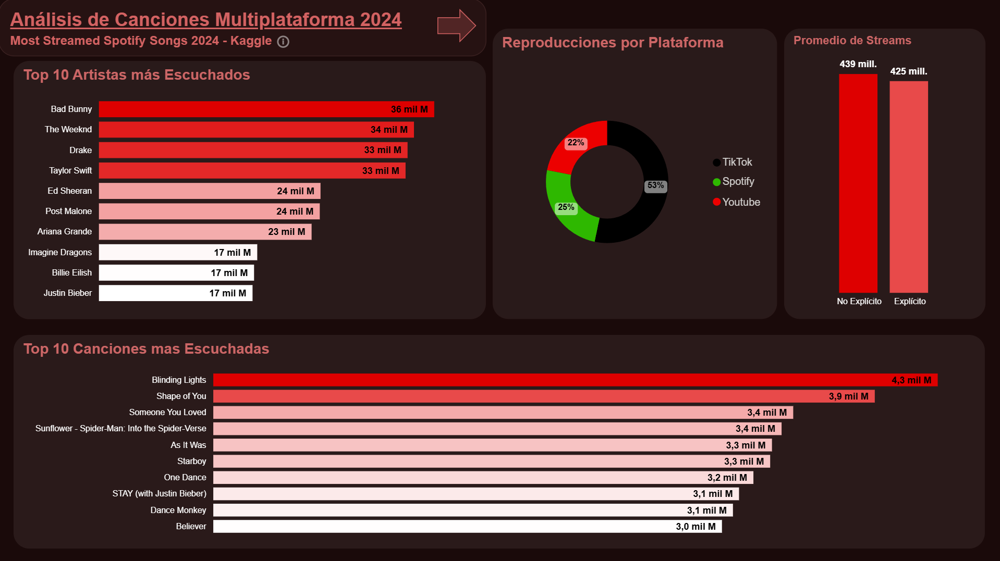
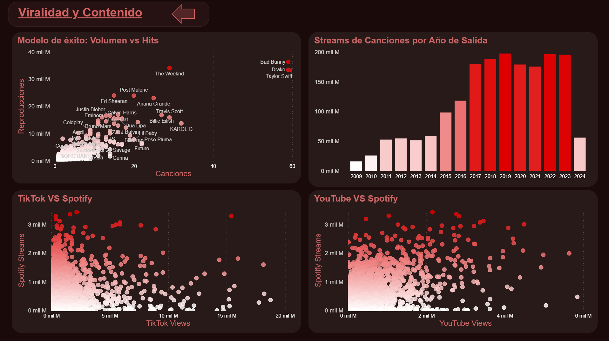

# Análisis de Canciones 2024 - Spotify


Análisis exploratorio de datos (EDA) sobre canciones de Spotify con el objetivo de detectar principalmente patrones de éxito y el impacto de la viralidad de canciones en redes sociales sobre plataformas de streaming. Incluye limpieza del dataset, visualizaciones y un dashboard interactivo en Power BI.

---

## Estructura del repositorio

```
analisis_canciones_2024/
│
├── sql/
│   └── spotify_2024_database.sql   # Script para recrear la base de datos
├── assets/
│   ├── dashboard_1.png             # Captura página 1 del dashboard
│   └── dashboard_2.png             # Captura página 2 del dashboard
├── spotify_analysis.ipynb          # Notebook principal con EDA y visualizaciones
├── spotify_clean.csv               # Dataset limpio listo para análisis
├── Dashboard.pbix                  # Dashboard interactivo en Power BI
├── setup_db.py                     # Script para configurar la base de datos
├── pyproject.toml                  # Dependencias del proyecto
├── poetry.lock                     # Versiones exactas de las dependencias
└── .env.example                    # Plantilla de ejemplo de variables de entorno
```

---

## ¿Qué contiene este proyecto?

### 1. Limpieza de datos (`spotify_clean.csv`)
- Eliminación de valores nulos y duplicados
- Normalización de columnas
- Cambio de tipo de datos
- Exportación del dataset limpio para su uso en el análisis y el dashboard

### 2. Análisis exploratorio (EDA)
- Correlación multiplataforma
- Modelos de éxito en base a patrones en los datos
- Impacto de redes sociales en Spotify
- Dominancia de canciones según su fecha de lanzamiento

### 3. Visualizaciones
- Gráficos de distribución de streams y repertorio
- Rankings de artistas y canciones más populares
- Comparativas y tendencias a lo largo del dataset

### 4. Dashboard en Power BI (`Dashboard.pbix`)
- Vista interactiva de los indicadores y gráficos




---

## Hallazgos principales

- **Modelos de éxito coexisten:** Hay artistas que acumulan streams con catálogos grandes y otros con catálogos chicos con hits puntuales de alto impacto. Ambas estrategias funcionan, aunque el modelo de volumen domina enormemente.
- **La viralidad no garantiza streams:** la correlación entre viralidad en TikTok y streams en Spotify es prácticamente inexistente. En el caso de YouTube, existe una correlación débil muy poco determinante.
- **El contenido explícito no importa:** no se encontró evidencia significativa de que el contenido explícito influya en la popularidad de una canción en Spotify.
- **La novedad gana sobre la longevidad:** el streaming en 2024 favoreció canciones recientes, con una concentración notable de streams en lanzamientos del período 2017-2023.

---

## Tecnologías y requisitos

| Herramienta | Uso
|---|---
| Python 3.12 | Limpieza, análisis y visualización
| SQL | Recolección de datos a través de base de datos local
| Pandas | Manipulación del dataset
| Matplotlib / Seaborn | Gráficos exploratorios
| Jupyter Notebook | Entorno de desarrollo
| Power BI | Dashboard interactivo
| MySQL Server | Base de datos local
| poetry | Gestión de entorno virtual y dependencias

---

## Cómo ejecutar el proyecto

### Instalación

### Instalación

1. Instalar dependencias
```bash
poetry install
```

2. Activar el entorno virtual
```bash
poetry shell
```

3. Configurar variables de entorno
   - Copiar el archivo `.env.example` y renombrarlo a `.env`
   - Completar con los datos de tu instalación de MySQL:
   
   ```bash
   USER=tu_usuario_mysql
   PASSWORD=tu_contraseña_mysql
   HOSTNAME=localhost
   PORT=3306
   ```
   - Por defecto, el usuario suele ser `root`, el hostname `localhost` y el puerto `3306`

4. Configurar la base de datos
   - Una vez configurado el `.env`, correr el siguiente script para crear e importar la base de datos automáticamente:
```bash
   python setup_db.py
```

---

## Créditos

Dataset original: [Most Streamed Spotify Songs 2024](https://www.kaggle.com/datasets/nelgiriyewithana/most-streamed-spotify-songs-2024)

## 👤 Autor

**JackyDye**  
[GitHub](https://github.com/JackyDye)